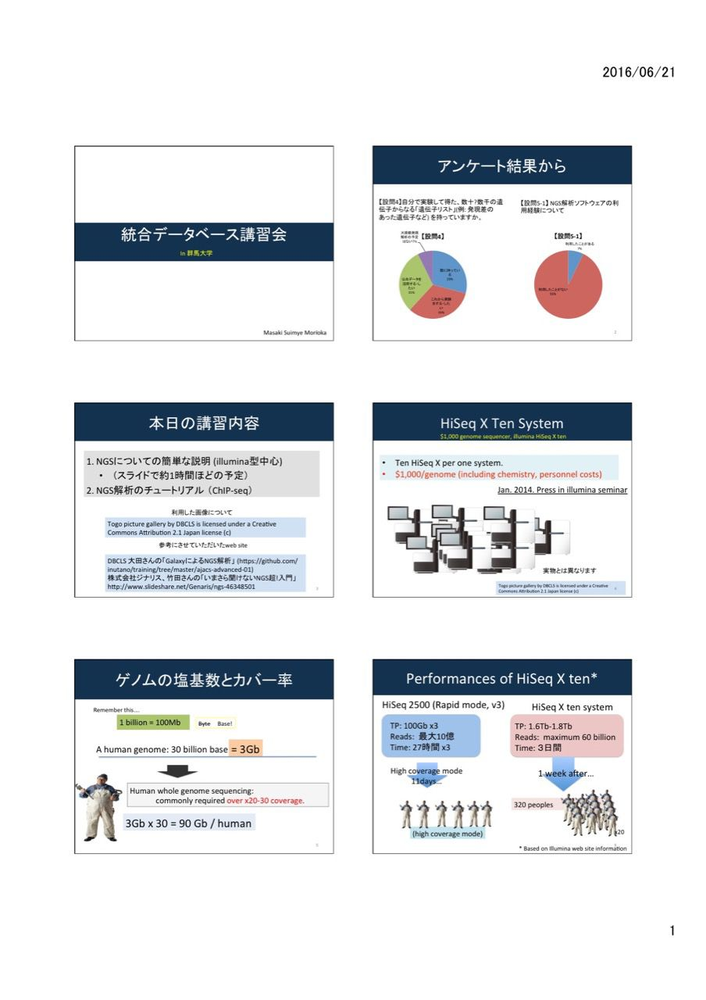
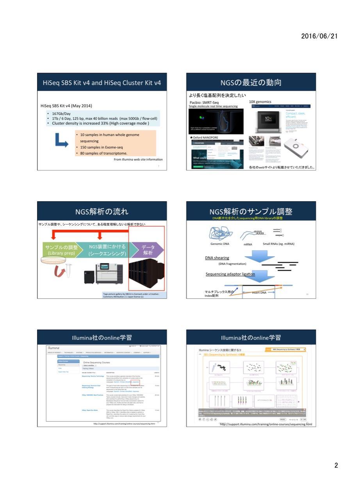
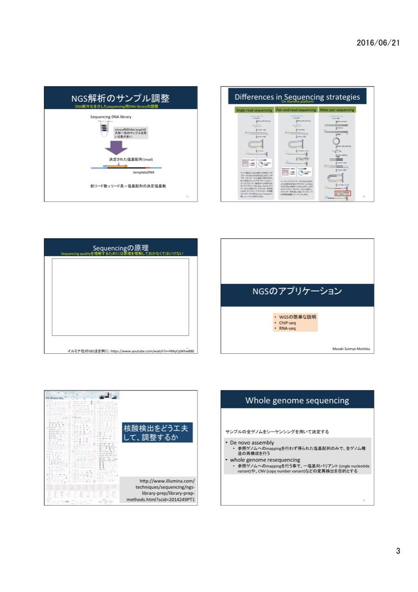
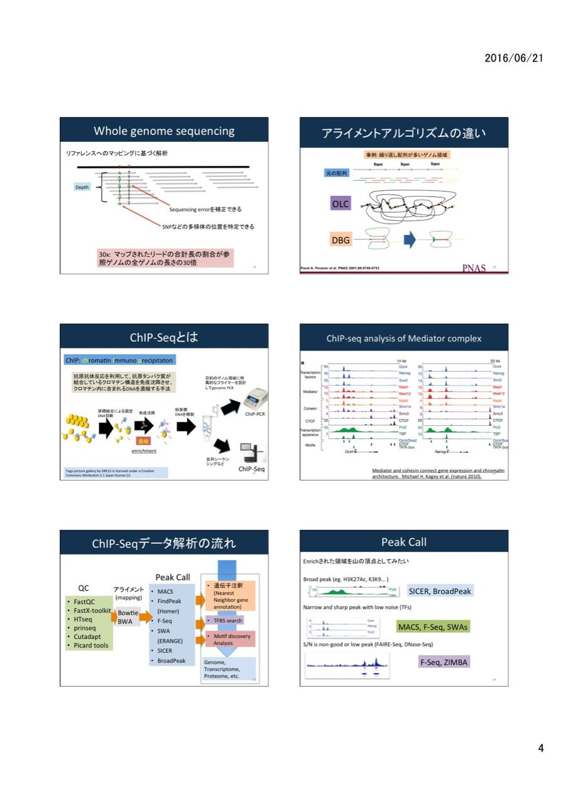
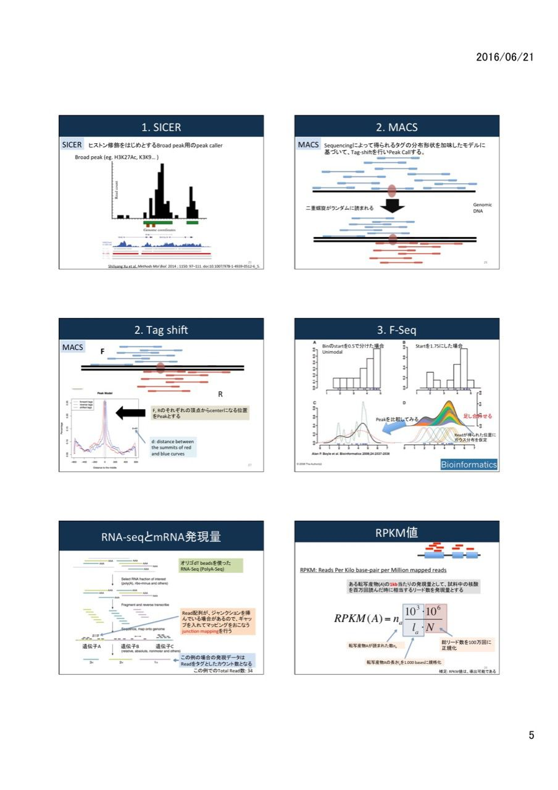
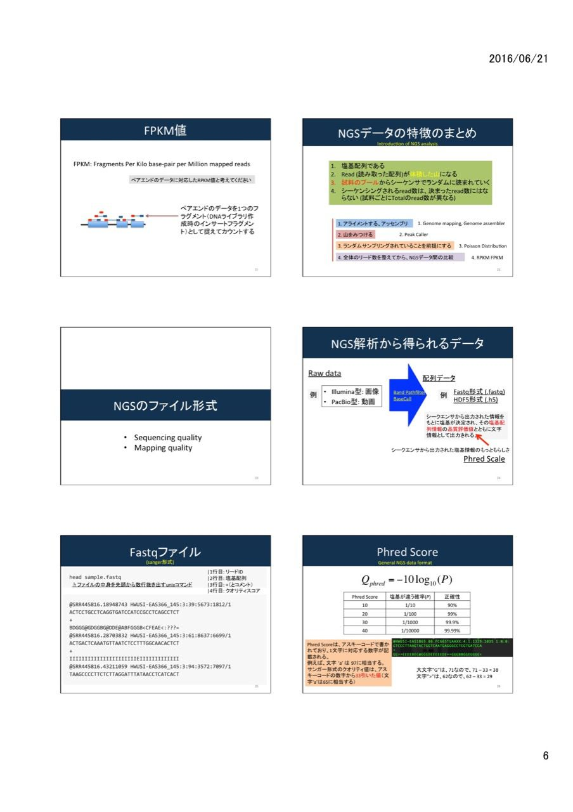
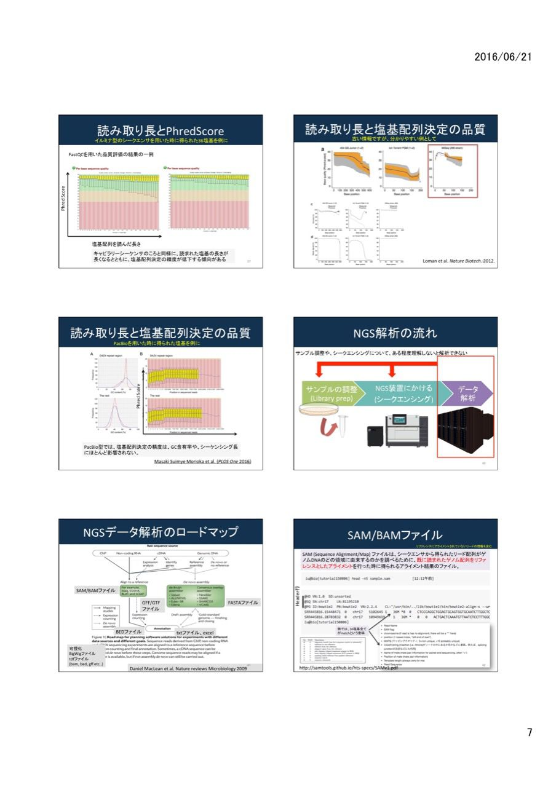
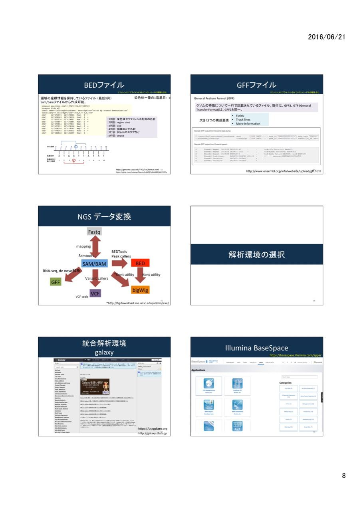
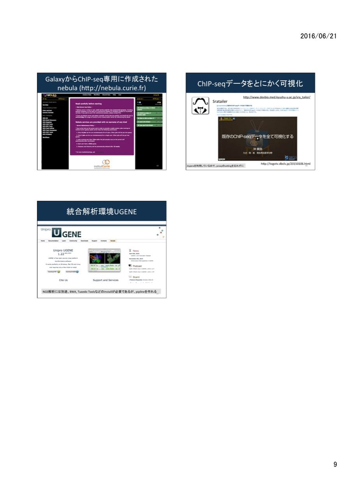

# NGS基礎実習（森岡担当）
NGS解析の練習として、ChIP-seqを中心としたの実習を行います。RNA-seqやChIP-seqは、それぞれの異なるサーバで解析していただきますので、コースよりお選びください。2,3番については、**自分で読んで、調べて解析していただくコースになりますので、当日のレクチャーがありません。2,3の質問は講義の最後にどうぞ。**

- 【事前準備】：お持込予定のPCに、以下ソフトウェア等のインストールをお願いいたします。

   - 名称
Integrative Genomics Viewer (IGV)

   - 使用する講習
14:00-17:00　「次世代シークエンサデータ解析の基礎知識（BaseSpaceOnsite, GalaxyなどのNGS解析ツールを理解するために必要な知識）」

   - 手順
IGVのwebサイト（http://www.broadinstitute.org/igv/）にアクセスし、ダウンロード・インストールします。
インストールには予め　名前、所属、メールアドレスの登録が必要となります。

- [講義資料へのリンク](https://drive.google.com/folderview?id=0B4oXGzAZTVKefkw5NUJQdkYtQnZUWWRmWHgwLVd3RTNTVWVCUUtsSDZSRi12SnNqekZfZFU&usp=sharing)

## コース

1. [ChIP-seq初心者コース](https://github.com/suimye/gunmadai/wiki/nebula_chipseq)
	- galaxyのnebulaを利用したChIP-seq解析コースになります。NGS解析に慣れるために今回mainで行います。

2. [上級者(MAC, terminalが使える, 謎解きをしたい人)コース](https://github.com/suimye/NGS_handson2015/wiki/NGS_senior)
	- 以前のAJACSで行った初級〜中級者向けコースを実施していただきます。

	
	---

	
	---

	
	---

	
	---

	
	---

	
	---

	
	---

	
	---

	
	---
